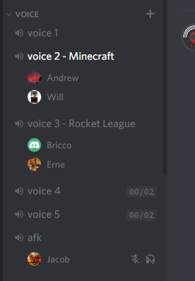

# Channel Changer
Discord bot that changes voice channel names based on what games people are playing in it

## [Invite the Bot!](https://discordapp.com/oauth2/authorize?client_id=551085114004602882&scope=bot&permissions=16)
  

## Commands
Not all commands will work according to how the bot is preferenced.
 - `!help` To show all these commands in Discord.
 - `!addvc` Whitelists the VoiceChannel you're in.
 - `!removevc` Removes the VoiceChannel you're in from the whitelist.
 - `!addadmin @member` Allows the member to operate the bot.
 - `!removeadmin @member` Removes the member from operating the bot.
 - `!test` Tests Channel Changer with the VoiceChannel you're in
 - `!reset` Resets the VoiceChannel you're in, if it was changed
 - `!shorten "old name" "new name"` Abbreviates the old name provided to the new name.
 - `!template` Sets the template ex. `!template X - Y`. If a new template is not provided it will reply with the current one.
 - `!majority` Sets what percentage of people have to be playing the same game for it to change the name. Ex. `!majority 25`. If a new majority is not provided then it will reply with the current.

### Bot Owner Commands
 - `!save` Save the configs
 - `!load` Load the configs
 - `!config` Replies with the config being used

### Template Guide
Channel Changer uses RegEx to replace the channel's name with the most played game. Take a VoiceChannel called "Lounge" with CS:GO players as an example. X is the channel's name, and Y is the game being played so "X - Y" will be "Lounge - CS:GO".
 - `X` Channel's name
 - `Y` Most played game

### Starting the Bot
`npm start`

